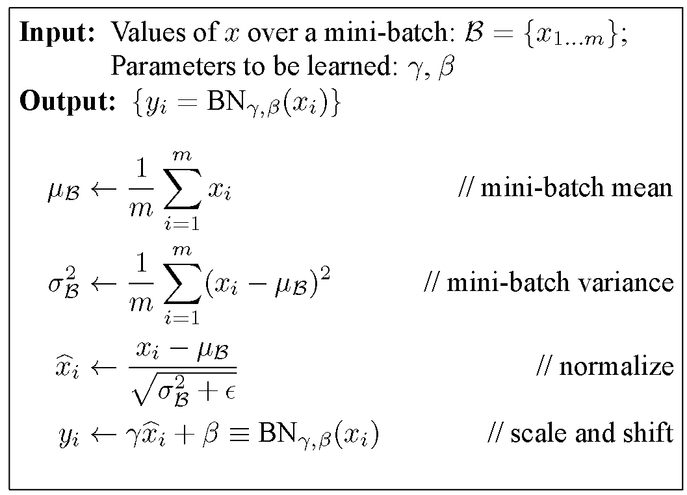
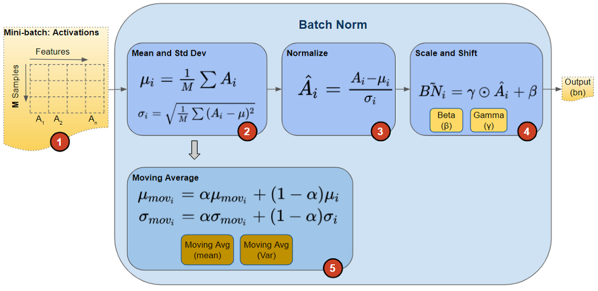
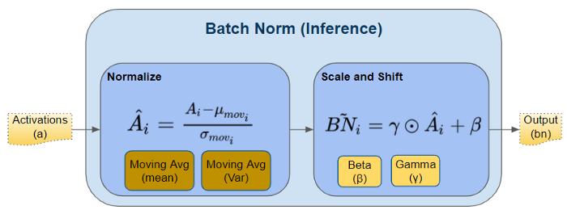
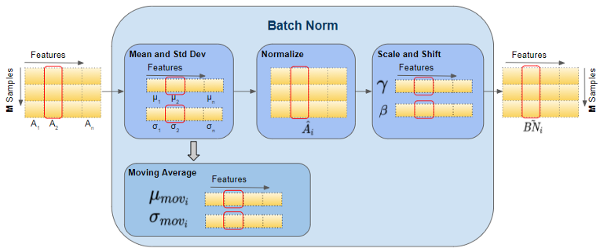

```python
from IPython.core.interactiveshell import InteractiveShell
InteractiveShell.ast_node_interactivity = "last_expr_or_assign"

import torch
import torch.nn as nn
```

## Formula



## Training

Source: https://towardsdatascience.com/batch-norm-explained-visually-how-it-works-and-why-neural-networks-need-it-b18919692739


## BatchNorm1d Illustration


```python
N, D = 3, 5
input1d = torch.arange(N * D).reshape(N, D).float()
```


    tensor([[ 0.,  1.,  2.,  3.,  4.],
            [ 5.,  6.,  7.,  8.,  9.],
            [10., 11., 12., 13., 14.]])


```python
bn1d = nn.BatchNorm1d(D)
```


    BatchNorm1d(5, eps=1e-05, momentum=0.1, affine=True, track_running_stats=True)


```python
bn1d.state_dict()
```


    OrderedDict([('weight', tensor([1., 1., 1., 1., 1.])),
                 ('bias', tensor([0., 0., 0., 0., 0.])),
                 ('running_mean', tensor([0., 0., 0., 0., 0.])),
                 ('running_var', tensor([1., 1., 1., 1., 1.])),
                 ('num_batches_tracked', tensor(0))])


```python
vars(bn1d)
```


    {'training': True,
     '_parameters': OrderedDict([('weight', Parameter containing:
                   tensor([1., 1., 1., 1., 1.], requires_grad=True)),
                  ('bias',
                   Parameter containing:
                   tensor([0., 0., 0., 0., 0.], requires_grad=True))]),
     '_buffers': OrderedDict([('running_mean',
                   tensor([0.5000, 0.6000, 0.7000, 0.8000, 0.9000])),
                  ('running_var',
                   tensor([3.4000, 3.4000, 3.4000, 3.4000, 3.4000])),
                  ('num_batches_tracked', tensor(1))]),
     '_non_persistent_buffers_set': set(),
     '_backward_hooks': OrderedDict(),
     '_is_full_backward_hook': None,
     '_forward_hooks': OrderedDict(),
     '_forward_pre_hooks': OrderedDict(),
     '_state_dict_hooks': OrderedDict(),
     '_load_state_dict_pre_hooks': OrderedDict(),
     '_modules': OrderedDict(),
     'num_features': 5,
     'eps': 1e-05,
     'momentum': 0.1,
     'affine': True,
     'track_running_stats': True}


```python
output1d = bn1d(input1d)
```


    tensor([[-1.2247, -1.2247, -1.2247, -1.2247, -1.2247],
            [ 0.0000,  0.0000,  0.0000,  0.0000,  0.0000],
            [ 1.2247,  1.2247,  1.2247,  1.2247,  1.2247]],
           grad_fn=<NativeBatchNormBackward>)


```python
bn1d.state_dict()
```


    OrderedDict([('weight', tensor([1., 1., 1., 1., 1.])),
                 ('bias', tensor([0., 0., 0., 0., 0.])),
                 ('running_mean',
                  tensor([0.5000, 0.6000, 0.7000, 0.8000, 0.9000])),
                 ('running_var', tensor([3.4000, 3.4000, 3.4000, 3.4000, 3.4000])),
                 ('num_batches_tracked', tensor(1))])


```python
m = torch.Tensor.mean(input1d, 0)
```


    tensor([5., 6., 7., 8., 9.])


```python
v = torch.Tensor.var(input1d, 0, False)
```


    tensor([16.6667, 16.6667, 16.6667, 16.6667, 16.6667])


```python
(input1d - m) / torch.sqrt(v)
```


    tensor([[-1.2247, -1.2247, -1.2247, -1.2247, -1.2247],
            [ 0.0000,  0.0000,  0.0000,  0.0000,  0.0000],
            [ 1.2247,  1.2247,  1.2247,  1.2247,  1.2247]])


## Momentum

- running_mean = momentum * running_mean + (1-momentum) * sample_mean
- running_var = momentum * running_var + (1-momentum) * sample_var


```python
bn1d_m1 = nn.BatchNorm1d(D, momentum=1)
```


    BatchNorm1d(5, eps=1e-05, momentum=1, affine=True, track_running_stats=True)


```python
bn1d_m1(input1d)
```


    tensor([[-1.2247, -1.2247, -1.2247, -1.2247, -1.2247],
            [ 0.0000,  0.0000,  0.0000,  0.0000,  0.0000],
            [ 1.2247,  1.2247,  1.2247,  1.2247,  1.2247]],
           grad_fn=<NativeBatchNormBackward>)


```python
bn1d_m1.state_dict()
```


    OrderedDict([('weight', tensor([1., 1., 1., 1., 1.])),
                 ('bias', tensor([0., 0., 0., 0., 0.])),
                 ('running_mean', tensor([5., 6., 7., 8., 9.])),
                 ('running_var', tensor([25., 25., 25., 25., 25.])),
                 ('num_batches_tracked', tensor(1))])


```python

```


```python
v = torch.Tensor.var(input1d, 0, True)
```


    tensor([25., 25., 25., 25., 25.])


```python
bn1d_m_half = nn.BatchNorm1d(D, momentum=0.5)
```


    BatchNorm1d(5, eps=1e-05, momentum=0.5, affine=True, track_running_stats=True)


```python
bn1d_m_half(input1d)
```


    tensor([[-1.2247, -1.2247, -1.2247, -1.2247, -1.2247],
            [ 0.0000,  0.0000,  0.0000,  0.0000,  0.0000],
            [ 1.2247,  1.2247,  1.2247,  1.2247,  1.2247]],
           grad_fn=<NativeBatchNormBackward>)


```python
bn1d_m_half.state_dict()
```


    OrderedDict([('weight', tensor([1., 1., 1., 1., 1.])),
                 ('bias', tensor([0., 0., 0., 0., 0.])),
                 ('running_mean',
                  tensor([2.5000, 3.0000, 3.5000, 4.0000, 4.5000])),
                 ('running_var', tensor([13., 13., 13., 13., 13.])),
                 ('num_batches_tracked', tensor(1))])


```python
input1d_2 = torch.arange(0, 2 * N * D, 2).reshape(N, D).float()
```


    tensor([[ 0.,  2.,  4.,  6.,  8.],
            [10., 12., 14., 16., 18.],
            [20., 22., 24., 26., 28.]])


```python
bn1d_m_half(input1d_2)
```


    tensor([[-1.2247, -1.2247, -1.2247, -1.2247, -1.2247],
            [ 0.0000,  0.0000,  0.0000,  0.0000,  0.0000],
            [ 1.2247,  1.2247,  1.2247,  1.2247,  1.2247]],
           grad_fn=<NativeBatchNormBackward>)


```python
bn1d_m_half.state_dict()
```


    OrderedDict([('weight', tensor([1., 1., 1., 1., 1.])),
                 ('bias', tensor([0., 0., 0., 0., 0.])),
                 ('running_mean',
                  tensor([ 6.2500,  7.5000,  8.7500, 10.0000, 11.2500])),
                 ('running_var',
                  tensor([56.5000, 56.5000, 56.5000, 56.5000, 56.5000])),
                 ('num_batches_tracked', tensor(2))])


```python
torch.Tensor.var(input1d_2, 0, True)
```


    tensor([100., 100., 100., 100., 100.])


```python
13*0.5 + 100*0.5
```


    56.5


## Test 


## Affine: Weight & Bias


```python
output1d.sum().backward()
```


```python
bn1d.weight.grad
```


    tensor([0., 0., 0., 0., 0.])


```python
bn1d.bias.grad
```


    tensor([3., 3., 3., 3., 3.])


```python
bn1d.parameters()
```


    <generator object Module.parameters at 0x00000172BE5063C0>


```python
optimizer = torch.optim.RMSprop(bn1d.parameters(), lr=0.01)
```


    RMSprop (
    Parameter Group 0
        alpha: 0.99
        centered: False
        eps: 1e-08
        lr: 0.01
        momentum: 0
        weight_decay: 0
    )


```python
optimizer.step()
```


```python
bn1d.bias
```


    Parameter containing:
    tensor([-0.1000, -0.1000, -0.1000, -0.1000, -0.1000], requires_grad=True)


## Shape


## BatchNorm2d Illustration


```python
N, C, H, W = 3, 2, 4, 5
```


```python
input2d = torch.arange(N * C * H * W).reshape(N, C, H, W).float()
```


    tensor([[[[  0.,   1.,   2.,   3.,   4.],
              [  5.,   6.,   7.,   8.,   9.],
              [ 10.,  11.,  12.,  13.,  14.],
              [ 15.,  16.,  17.,  18.,  19.]],
    
             [[ 20.,  21.,  22.,  23.,  24.],
              [ 25.,  26.,  27.,  28.,  29.],
              [ 30.,  31.,  32.,  33.,  34.],
              [ 35.,  36.,  37.,  38.,  39.]]],
    
    
            [[[ 40.,  41.,  42.,  43.,  44.],
              [ 45.,  46.,  47.,  48.,  49.],
              [ 50.,  51.,  52.,  53.,  54.],
              [ 55.,  56.,  57.,  58.,  59.]],
    
             [[ 60.,  61.,  62.,  63.,  64.],
              [ 65.,  66.,  67.,  68.,  69.],
              [ 70.,  71.,  72.,  73.,  74.],
              [ 75.,  76.,  77.,  78.,  79.]]],
    
    
            [[[ 80.,  81.,  82.,  83.,  84.],
              [ 85.,  86.,  87.,  88.,  89.],
              [ 90.,  91.,  92.,  93.,  94.],
              [ 95.,  96.,  97.,  98.,  99.]],
    
             [[100., 101., 102., 103., 104.],
              [105., 106., 107., 108., 109.],
              [110., 111., 112., 113., 114.],
              [115., 116., 117., 118., 119.]]]])


```python
bn2d = nn.BatchNorm2d(C)
```


    BatchNorm2d(2, eps=1e-05, momentum=0.1, affine=True, track_running_stats=True)


```python
bn2d.state_dict()
```


    OrderedDict([('weight', tensor([1., 1.])),
                 ('bias', tensor([0., 0.])),
                 ('running_mean', tensor([0., 0.])),
                 ('running_var', tensor([1., 1.])),
                 ('num_batches_tracked', tensor(0))])


```python
output2d = bn2d(input2d)
```


    tensor([[[[-1.4925, -1.4624, -1.4322, -1.4021, -1.3719],
              [-1.3418, -1.3116, -1.2815, -1.2513, -1.2212],
              [-1.1910, -1.1609, -1.1307, -1.1006, -1.0704],
              [-1.0403, -1.0101, -0.9799, -0.9498, -0.9196]],
    
             [[-1.4925, -1.4624, -1.4322, -1.4021, -1.3719],
              [-1.3418, -1.3116, -1.2815, -1.2513, -1.2212],
              [-1.1910, -1.1609, -1.1307, -1.1006, -1.0704],
              [-1.0403, -1.0101, -0.9799, -0.9498, -0.9196]]],
    
    
            [[[-0.2864, -0.2563, -0.2261, -0.1960, -0.1658],
              [-0.1357, -0.1055, -0.0754, -0.0452, -0.0151],
              [ 0.0151,  0.0452,  0.0754,  0.1055,  0.1357],
              [ 0.1658,  0.1960,  0.2261,  0.2563,  0.2864]],
    
             [[-0.2864, -0.2563, -0.2261, -0.1960, -0.1658],
              [-0.1357, -0.1055, -0.0754, -0.0452, -0.0151],
              [ 0.0151,  0.0452,  0.0754,  0.1055,  0.1357],
              [ 0.1658,  0.1960,  0.2261,  0.2563,  0.2864]]],
    
    
            [[[ 0.9196,  0.9498,  0.9799,  1.0101,  1.0403],
              [ 1.0704,  1.1006,  1.1307,  1.1609,  1.1910],
              [ 1.2212,  1.2513,  1.2815,  1.3116,  1.3418],
              [ 1.3719,  1.4021,  1.4322,  1.4624,  1.4925]],
    
             [[ 0.9196,  0.9498,  0.9799,  1.0101,  1.0403],
              [ 1.0704,  1.1006,  1.1307,  1.1609,  1.1910],
              [ 1.2212,  1.2513,  1.2815,  1.3116,  1.3418],
              [ 1.3719,  1.4021,  1.4322,  1.4624,  1.4925]]]],
           grad_fn=<NativeBatchNormBackward>)


```python
bn2d.state_dict()
```


    OrderedDict([('weight', tensor([1., 1.])),
                 ('bias', tensor([0., 0.])),
                 ('running_mean', tensor([4.9500, 6.9500])),
                 ('running_var', tensor([112.7559, 112.7559])),
                 ('num_batches_tracked', tensor(1))])


```python

```
